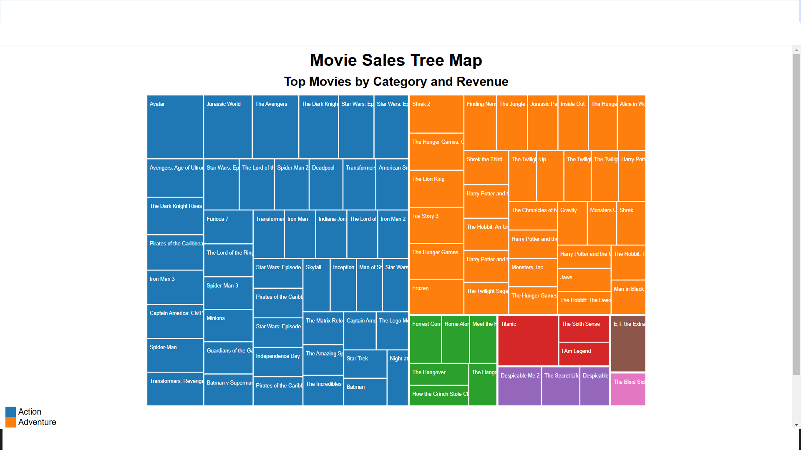

# Treemap-Diagram

## Overview

This project visualizes movie sales data using a treemap diagram. The treemap diagram is created using D3.js and displays the top movies by category and revenue.

## Features

- Interactive treemap diagram
- Tooltip displaying movie details on hover
- Legend indicating movie categories

## Usage

To view the treemap diagram, open the `index.html` file in a web browser.

## Project Structure
